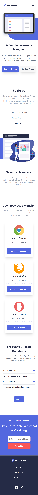
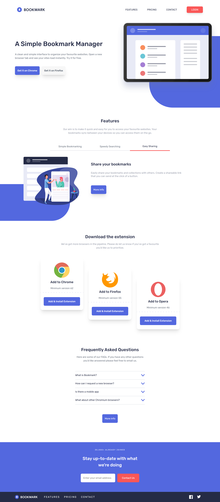

# Frontend Mentor - Bookmark landing page solution

This is a solution to the [Bookmark landing page challenge on Frontend Mentor](https://www.frontendmentor.io/challenges/bookmark-landing-page-5d0b588a9edda32581d29158). Frontend Mentor challenges help you improve your coding skills by building realistic projects.

## Table of contents

- [Overview](#overview)
  - [The challenge](#the-challenge)
  - [Screenshot](#screenshot)
  - [Links](#links)
- [My process](#my-process)
  - [Built with](#built-with)
  - [What I learned](#what-i-learned)
  - [Continued development](#continued-development)
  - [Useful resources](#useful-resources)
- [Author](#author)

## Overview

This challenge will really test layout skills. There are also areas that will require some JavaScript, such as the tabbed features section and the FAQ accordion.

### The challenge

Users should be able to:

- View the optimal layout for the site depending on their device's screen size
- See hover states for all interactive elements on the page
- Receive an error message when the newsletter form is submitted if:
  - The input field is empty
  - The email address is not formatted correctly

### Screenshot




### Links

- Solution URL: [Solution](https://github.com/remainhumble/bookmark-landing-page)
- Live Site URL: [Live Site](https://remainhumble.github.io/bookmark-landing-page/)

## My process

- Planned the layout structure with semantic HTML
- Designed mobile-first responsive styles using CSS Grid and Flexbox
- Implemented tabbed navigation with vanilla JavaScript
- Built accordion component for FAQ section
- Tested across multiple device breakpoints
- Validated form inputs and displayed error messages

### Built with

- Semantic HTML5 markup
- CSS custom properties
- Flexbox
- Mobile-first workflow
- [React](https://reactjs.org/) - JS library
- [Tailwind](https://tailwindcss.com/) - Tailwind CSS

### What I learned

I learned how to structure complex layouts using Tailwind effectively. Building the tabbed navigation taught me event delegation and DOM manipulation with vanilla JavaScript. Creating the accordion component improved my understanding of toggling states and managing multiple interactive elements. I also gained experience with form validation and displaying conditional error messages based on input state.

To see how you can add code snippets, see below:

```tailwind
<p class="text-blue-950 bg-red-400">You have a new message!</p>
```

### Continued development

- Advanced responsive design patterns with CSS Grid for complex layouts
- Deeper mastery of vanilla JavaScript event handling and state management
- Accessibility features (ARIA labels, keyboard navigation, screen reader testing)
- Performance optimization techniques and lazy loading implementations
- CSS animations and transitions for smoother user interactions
- Testing frameworks and writing unit tests for components

### Useful resources

- [ChatGPT](https://chatgpt.com/) - Changed the BOOKMARK color to white while leaving the blue circle and inner bookmark unchanged.
- [Tailwind Headers](https://tailwindcss.com/plus/ui-blocks/marketing/elements/headers) - This is an size which contains examples that are designed and built by the Tailwind CSS team, and include a variety of different styles and layouts.
- [transform](https://transform.tools/css-to-tailwind) - Convert Vanilla CSS to Tailwind CSS.
- [ClampCSS](https://clampcss.com/css-filter.html) - The ultimate tool to convert HEX or RGB colors into accurate CSS filters with ease.

## Author

- Frontend Mentor - [@remainhumble](https://www.frontendmentor.io/profile/remainhumble)
- X(formerly Twitter) - [@thiflan120699](https://x.com/thiflan120699)
